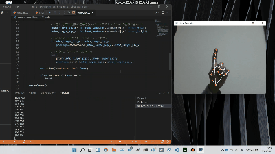

# Touchless Mouse Control | 非接触マウス
Due to the effects of the COVID-19, people are becoming more sensitive to contact.
This respository includes programs to enable touchless control without special devices.

## Demo


## Getting Started
### Installing
```
pip install -r requirements.txt
```

## Execution
```
python mouse_controller.py
```

### Commands
- **Move the tip of index finger** move mouse cursor
- **Fold index finger** double click 